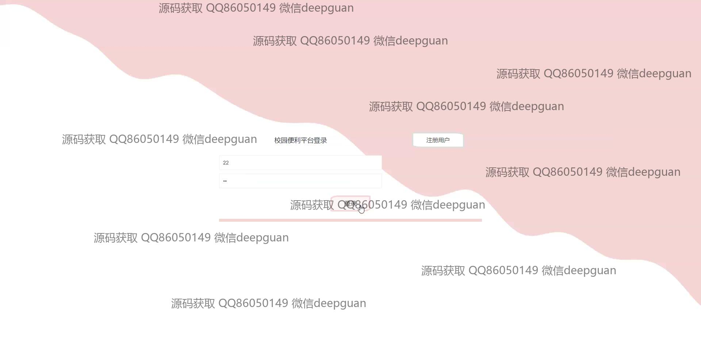
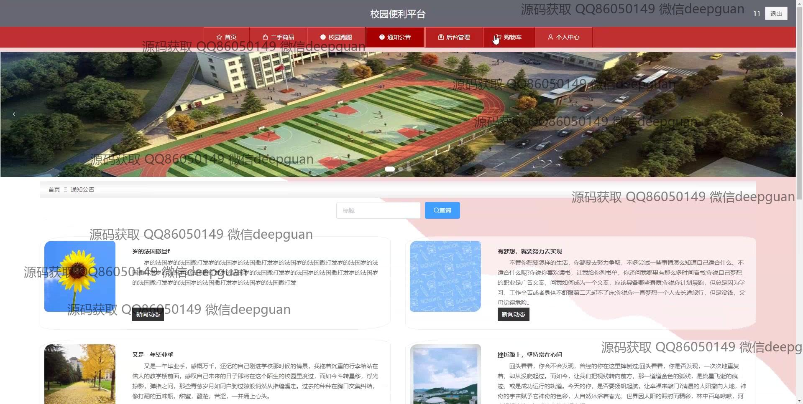

<h1 align="center">校园便利平台</h1>

## 简介
校园便利平台：功能涵盖商品展示与购物、跑腿服务、订单管理和用户评价。系统角色包括管理员与普通用户，支持商品管理、订单处理、用户信息维护及校园公告发布等功能。    --计算机毕业设计源码；毕设源码；java毕业设计源码

## 联系方式

<h3 align="center">获取完整代码与数据库文件 + 微信：deepguan QQ: 86050149 QQ群: 783742310</h3>

<h3 align="center">可帮忙远程部署 包运行成功！提供远程部署、修改代码、设计文档指导、代码讲解等服务！</h3>

## 功能介绍（完整见运行截图）
管理员：基本功能包括登录、注册和退出，提供通知公告管理、用户管理、商品类型管理、跑腿订单管理等功能模块。可进行订单管理和商品管理，包括增删改查，查看订单详情，管理校园跑腿任务，处理用户注册与评论，确保平台高效运营。

用户：基本功能涉及注册、登录和退出，能浏览商品详情、进行商品搜索并使用购物车功能。用户可以进行下单支付和评论查看，在个人中心管理个人信息，包括查看和修改个人信息、订单状态、收货地址以及收藏维护。为跑腿服务提供订单填写和管理选项，便于用户进行相关操作。

跑腿人员：主要涉及校园跑腿服务的任务接收和管理。功能包括填写和编辑跑腿任务信息，查看任务领取状态及相关详情。能够处理各种跑腿任务的状态变更，以及与用户之间的实时联系和任务交付反馈，加强整体服务体验。

开发者：使用Spring Boot框架开发，支持商品浏览、订单处理、支付结算、用户评价及后台管理。系统整体设计符合校园便利需求，功能模块化实现，简洁直观，注重用户体验，同时为二次开发提供扩展性，支持校园内服务灵活变更与快速响应。

## 运行截图

本代码来源于网络,仅供学习参考使用!

